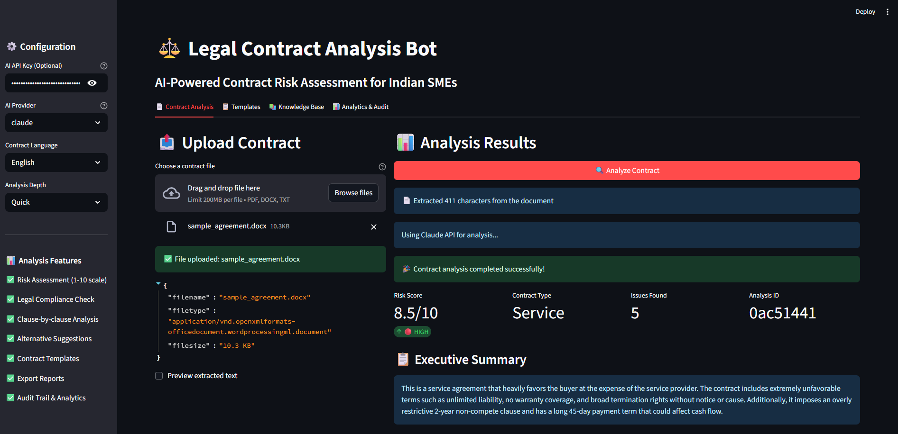
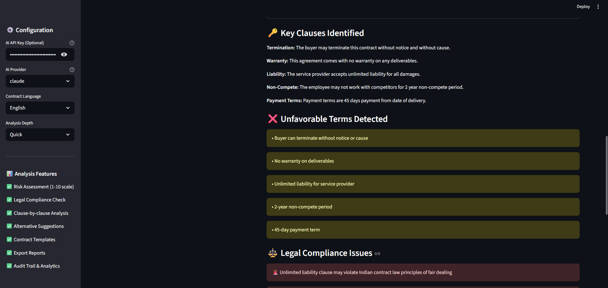
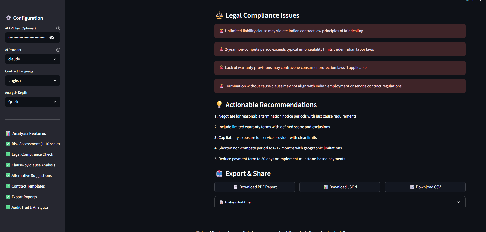
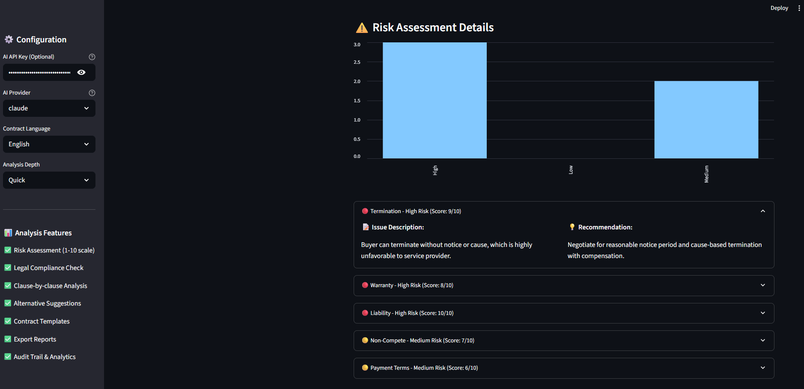

# ⚖️ Legal Contract Analysis Bot

> **AI-Powered Contract Risk Assessment for Indian SMEs**
>
> An intelligent legal contract analyzer designed to identify risky clauses, check compliance with Indian business regulations, and generate detailed report cards. Powered by a flexible AI backend (supporting Claude API or any OpenAI-compatible endpoint) with a fast, offline rule-based fallback system.

---

## 📸 Screenshots

| Analysis Result | Risk Details |
|---|---|
|  |  |

| Key Clauses | Compliance Issues |
|---|---|
|  |  |

---

## 🚀 Key Features

*   **Risk Scoring & Classification**: Clause-by-clause evaluation on a 1-10 scale with automated severity classification (High, Medium, Low).
*   **Indian Legal Compliance Engine**: Automated checks against key Indian regulations, including:
    *   **MSMED Act**: Ensuring vendor payment terms comply with the mandatory 45-day payment timeline.
    *   **Factories Act**: Checking working hour limitations and compliance.
    *   **Industrial Disputes Act**: Notice period compliance checking.
    *   **GST Act**: Verifying GST requirements.
    *   **Rent Control Act & Stamp Duty**: Lease terms and registration requirements.
*   **Dual Analysis Modes**:
    *   **AI-Powered Mode (Online)**: Performs deep contextual analysis using Claude API or any OpenAI-compatible endpoint.
    *   **Rule-Based Mode (Offline Fallback)**: Runs instant keyword and regex-based evaluations on common risky terms, requiring no internet or API keys.
*   **Multilingual Support**: Processing support for English, Hindi, and Tamil contracts:
    *   **Web Dashboard**: Allows users to select, log, and report contract languages in the database and generated PDF reports.
    *   **Experimental ML CLI**: Leverages `langdetect` for language identification, utilizes Indic-aware regex segmentation (supporting Hindi purna viram `।`), runs multilingual OCR via `pytesseract` (`eng+tam+hin`), and integrates `googletrans` to dynamically translate suggested alternatives back to the contract's source language.
*   **Detailed Export Reports**: Generate and download comprehensive evaluation reports in **PDF**, **JSON**, and **CSV** formats.
*   **Audit Trail & Analytics**: Persistent history tracking using an SQLite database (`audit_trail.db`) to record processing times, contract types, file sizes, and final risk profiles.
*   **Predefined Templates**: Access quick templates for common contract types (Employment, Vendor, Lease, Partnership, and Service) directly inside the interface.
*   **Legal Knowledge Base**: A built-in quick reference desk summarizing state and national Indian business laws.

---

## 🏗️ Architecture Flow

```
   [ Upload Contract ] (PDF / DOCX / TXT)
            │
            ▼
   [ Text Extraction ]
            │
            ▼
┌─────────────────────────────────────────┐
│              Analysis Mode              │
├────────────────────┬────────────────────┤
│   AI-Powered Mode  │  Rule-Based Mode   │
│ (Claude / OpenAI-  │ (Offline Fallback) │
│  Compatible API)   │                    │
└──────────┬─────────┴──────────┬─────────┘
           │                    │
           └─────────┬──────────┘
                     ▼
       [ Compliance & Risk Scoring ]
                     │
                     ▼
       [ Interactive Dashboard & Audit ]
                     │
                     ▼
       [ Export PDF / JSON / CSV ]
```

---

## 📁 Project Structure

*   [`app_enhanced.py`](file:///c:/Users/nanda/Desktop/projects/legal_assert/app_enhanced.py) — **Main Application Entrypoint**: Streamlit web dashboard orchestrating the UI, SQLite audit trail, compliance check logic, and AI/rule-based analysis.
*   [`pdf_generator.py`](file:///c:/Users/nanda/Desktop/projects/legal_assert/pdf_generator.py) — **Report Generator**: Generates professional PDF contract risk assessment reports with visual layout and clean styling using ReportLab.
*   [`requirements.txt`](file:///c:/Users/nanda/Desktop/projects/legal_assert/requirements.txt) — **Dependency Manifest**: Python package dependencies for running the app, ML pipeline, and document parsing utilities.
*   [`train_model.py`](file:///c:/Users/nanda/Desktop/projects/legal_assert/train_model.py) — **Model Trainer (Experimental)**: Training script that encodes `dataset.json` with Sentence Transformers and fits a LightGBM multiclass classifier for clause risk levels and contract types.
*   [`inference_pipeline.py`](file:///c:/Users/nanda/Desktop/projects/legal_assert/inference_pipeline.py) — **ML CLI Inference (Experimental)**: Standalone command-line inference engine that segments a contract document, makes vector-based predictions using trained LightGBM models, and returns nearest-neighbor recommendation alternatives.
*   [`dataset.json`](file:///c:/Users/nanda/Desktop/projects/legal_assert/dataset.json) — **Training Data**: 200 labeled contract clauses in English and Tamil for training and evaluation of the experimental ML pipeline.
*   [`legalapp.py`](file:///c:/Users/nanda/Desktop/projects/legal_assert/legalapp.py) — ⚠️ **Legacy App (Deprecated)**: Retained for archival reference. Do not use.

---

## ⚙️ Setup & Installation

### 1. Clone the Repository
```bash
git clone https://github.com/nandassk12/Legal-Contract-Analyzer.git
cd Legal-Contract-Analyzer
```

### 2. Install Dependencies
Make sure you have Python 3.9+ installed, then run:
```bash
pip install -r requirements.txt
```

### 3. Set Up Environment Variables
Create a `.env` file in the root directory (you can copy `.env.example` as a starting template):
```bash
cp .env.example .env
```

Open `.env` and fill in your AI provider details:
```env
# ── AI Provider (OpenAI-compatible API endpoint) ──────────────────────────────
# Supports any OpenAI-compatible API endpoint (such as OpenWebUI, LocalAI, etc.)
OPENWEBUI_BASE_URL=http://your-ai-host:port
OPENWEBUI_API_KEY=your-api-key-here
OPENWEBUI_MODEL=your-model-name-here
```

> **Note**: If `OPENWEBUI_BASE_URL` or `OPENWEBUI_API_KEY` are not provided in the environment (or via the sidebar text input), the application will automatically fall back to the offline, keyword-based analysis engine.

---

## ⚡ Running the App

Run the main Streamlit web application:
```bash
streamlit run app_enhanced.py
```
Open your browser and navigate to the local URL (typically `http://localhost:8501`).

---

## 🧠 Experimental ML Pipeline (CLI Only)

The project includes an experimental standalone Machine Learning pipeline that uses **Sentence Transformers** (SBERT embeddings) combined with **LightGBM** to predict clause risk levels and contract types from text.

### Train the ML models:
```bash
python train_model.py --input dataset.json --output_dir models
```
This command generates:
*   `train_embeddings.npy` — Embedded representations of the dataset clauses.
*   `train_suggestions.json` — A lookup file mapping training clauses to suggested alternatives.
*   `risk_model.joblib` & `type_model.joblib` — Trained LightGBM models.
*   Corresponding label encoders and Sentence Transformer metadata.

### Run CLI inference on a contract document:
Once trained, analyze local PDF, DOCX, or TXT documents using the ML pipeline:
```bash
python inference_pipeline.py --file your_contract.pdf --models_dir models
```
*Note: The ML pipeline is experimental and runs strictly in the command line; it is not integrated with the main Streamlit interface.*
